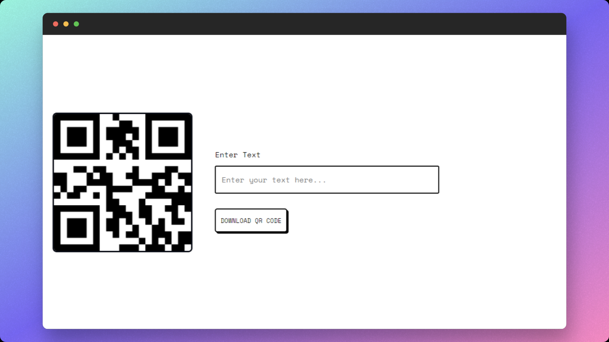

## What is MakeQRC?

MakeQRC is a web app to generate QR codes from text or URL.

### Features

- Minimal UI
- Easy to use
- Fast

## License

[HERE](https://github.com/Sharukhi/MakeQRC/blob/main/LICENSE)
