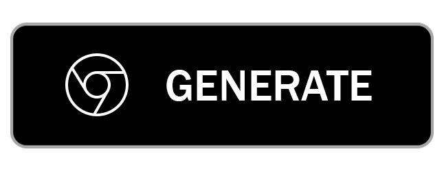
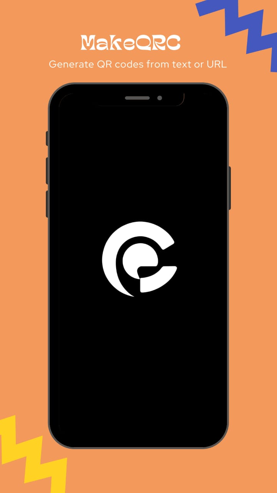
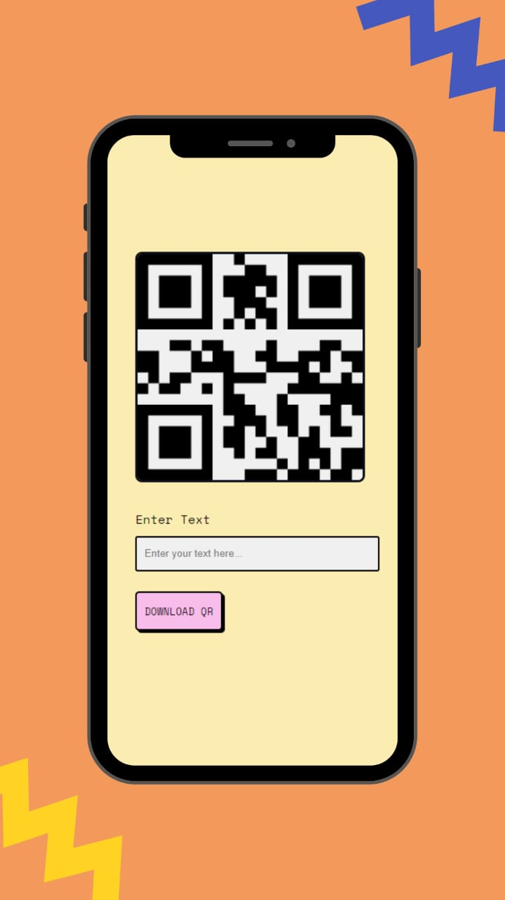

  

      
  

  <h2> MakeQRC </h2>
  
Generate QR codes from text or URL

## Features

- Minimal
- Easy to use
- Fast

## [Local setup ](/docs/local-setup.md)

## Licence
MakeQRC is licenced under [GPLv3](https://github.com/Sharukhi/makeqrc/blob/main/LICENSE.md) and anyone wanting to use it (as a base for your own project or even use some of its parts or features) has to adhere to this license completely. Make sure that you are aware of all the licensing terms before creating your own project based on MakeQRC.

Here some important points to keep in mind, as to how we handle licensing for MakeQRC:

- You cannot simply rename our app, strip it of all credit and upload it anywhere as your own, be this with or without monetization.
- You have to make changes in terms of design, features, etc before publishing it anywhere. Changing app name, package name and logo is not enough.
- You are required to give us full credits for any work you may be using from us.
- We will ALWAYS use all our legal options, if you do not strictly adhere to these licencing terms.

## Contribution

**Help us make MakeQRC even better**

**Submit your changes/modifications/features via pull request.**

